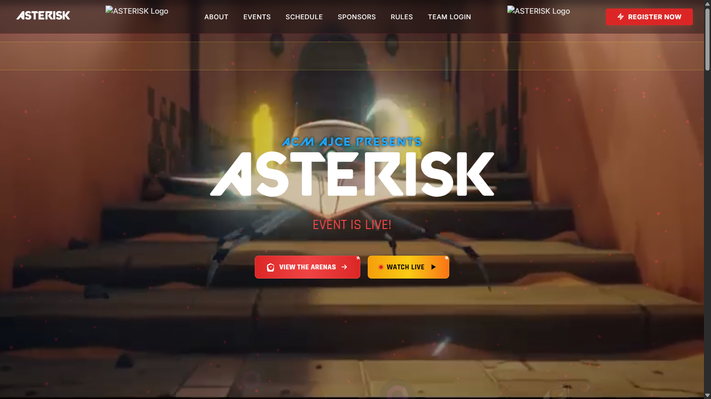
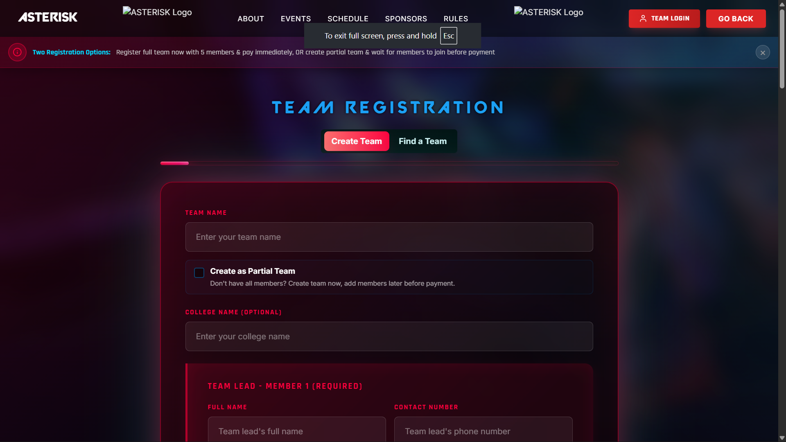

# Asterisk Tournament System

A tournament management and live streaming system built for esports events. Handles team registration, match scheduling, live scoring, and HLS streaming with interactive overlays.

## Features

- Tournament bracket management
- Live match streaming with custom overlays
- Real-time match scoring and updates
- Team registration and management
- Pause screen with team statistics
- WhatsApp notifications integration
- MongoDB and SQLite data persistence


## Screenshots

### Tournament Control Panel


### Live Stream with Overlay



## System Requirements

- Python 3.8+
- FFmpeg for streaming
- MongoDB database
- Node.js (for WhatsApp service)

## Setup

1. Clone the repository
2. Install Python dependencies:
   ```bash
   pip install -r requirements.txt
   ```
3. Set up environment variables:
   ```bash
   cp sample.env .env
   # Edit .env with your configuration
   ```
4. Start the WhatsApp notification service:
   ```bash
   cd notification-whatsapp
   go run main.go
   ```
5. Run the main server:
   ```bash
   python app.py
   ```
6. Start the HLS stream server:
   ```bash
   python live.py
   ```

## Architecture

- Main server (`app.py`): Tournament logic, API endpoints, core of project
- Stream server (`live.py`): HLS video streaming, to be deployed on each Device where match observer account is kept, to create stream sources
- WhatsApp service: Whatsmeow based whatsapp notification service
- Frontend: HTML/JS for control panels and overlays
- SSE: Server side events for realtime website updates without refreshing.

## License

MIT