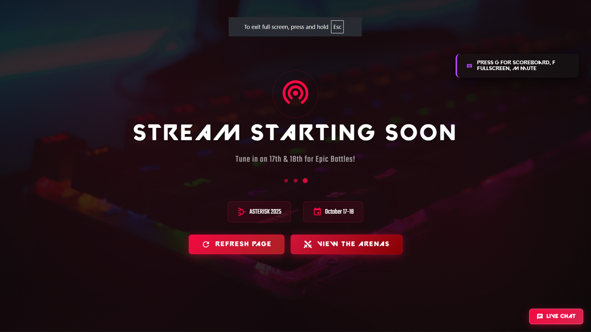
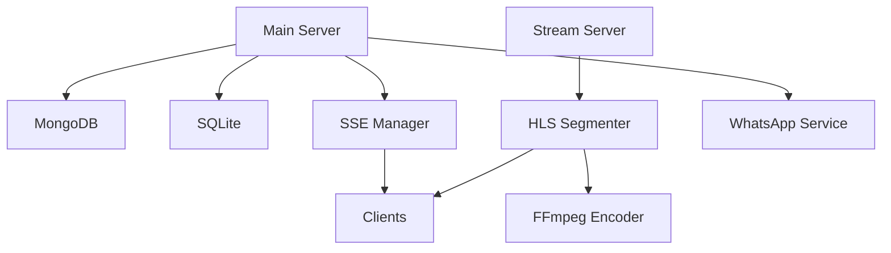

# Asterisk Tournament System

A distributed tournament management and real-time streaming system leveraging HLS (HTTP Live Streaming) protocol for esports events. Built with Python's aiohttp framework for async I/O operations, featuring real-time SSE updates, dual-database persistence, and automated match orchestration.

## Technical Stack

- **Backend Framework**: Python aiohttp (async HTTP server)
- **Streaming Protocol**: HTTP Live Streaming (HLS)
  - Segmented video delivery (.ts files)
  - Adaptive bitrate streaming
  - CORS-enabled endpoints
- **Real-time Updates**: Server-Sent Events (SSE)
  - Bi-directional WebSocket fallback
  - Event-driven architecture
- **Data Persistence**:
  - Primary: MongoDB (tournament state)
  - Backup: SQLite3 (registration data)
  - In-memory caching for active matches
- **Notification System**: 
  - WhatsApp integration via whatsmeow
  - Real-time event hooks
  - Rate-limited API endpoints


## Some Screenshots

### Website Landing Page


### Team Registration with Team finding system


### Live Stream Window



## System Requirements

- Python 3.8+ (async/await support)
- FFmpeg with libx264 and AAC codecs
- MongoDB 4.4+ (replica set recommended)
- Go 1.19+ (WhatsApp service)

## Deployment

1. Clone and configure environment:
   ```bash
   git clone https://github.com/AmarnathCJD/Asterisk.git
   cd Asterisk
   python -m venv venv
   source venv/bin/activate  # or venv\Scripts\activate on Windows
   pip install -r requirements.txt
   ```

2. Configure environment variables:
   ```bash
   cp sample.env .env
   # Required variables:
   # MONGODB_URL=mongodb://localhost:27017
   # MASTER_PASSWORD=your_admin_key
   # STREAM_RETENTION_HOURS=24
   ```

3. Deploy WhatsApp notification service:
   ```bash
   cd notification-whatsapp
   go mod download
   go build
   ./notification-whatsapp  # or notification-whatsapp.exe on Windows
   ```

4. Initialize streaming server:
   ```bash
   python live.py --port 5001 --codec libx264 --preset veryfast
   ```

5. Launch main application server:
   ```bash
   python app.py --host 0.0.0.0 --port 5000 --workers 4
   ```

## System Architecture

### Core Components

```
Asterisk/
├── app.py           # Main async application server
├── live.py          # HLS streaming orchestrator
└── notification-whatsapp/
    └── main.go      # Go-based notification service
```

### Service Architecture



- **Main Server** (`app.py`):
  - Async tournament state management
  - RESTful API endpoints (CORS-enabled)
  - Match orchestration logic
  - Real-time event propagation

- **Stream Server** (`live.py`):
  - HLS segment management
  - FFmpeg process orchestration
  - Adaptive bitrate streaming
  - CORS-compliant file serving

- **WhatsApp Service** (`main.go`):
  - Event-driven notification system
  - Rate-limited message delivery
  - Session persistence
  - Automated reconnection handling

## License

This project is licensed under the MIT License - see the [LICENSE](LICENSE) file for details. Copyright (c) 2025 Amarnath C. This software is part of the ASTERISK Tournament Management System developed for ACM AJCE's esports initiatives. While the code is open-source, any commercial use or deployment requires written permission from the project maintainers.